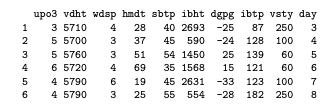
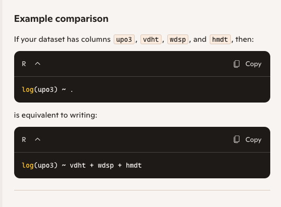
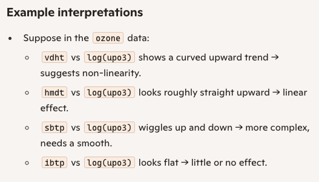
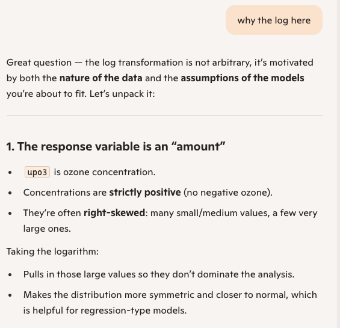
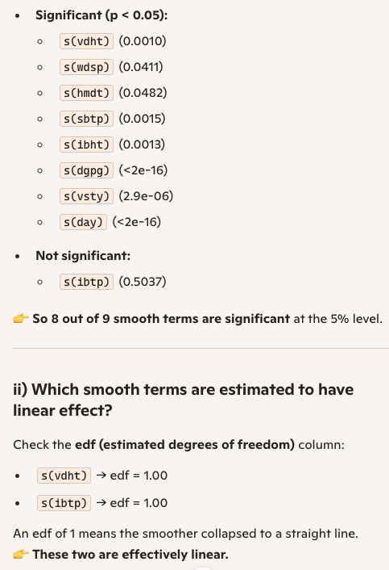

# Exercise

In this exercise we are going to use the“Ozone”data set from the gss (type?gss::ozone for more information about the data).

## if not yet there, install the package first in your console:

```{r}
# install.packages("gss")
data(ozone, package = "gss")
head(ozone)
```

{width="2000px,height=4000px"} ?gss::ozone

Our aim here is to fit a GAM model to the ozone data set.

As usual we start by visualising the response variable against each predictor. As the response variable can

only take positive values (i.e. is an “amount”) we log-transform it. This is often the standard procedure with concentrations.

To start “quick and dirty” we can create a graph with pairs().

```{r}
pairs(log(upo3)~. ,
data = ozone,
pch = ".",
upper.panel = panel.smooth)

```

{width="2000px,height=4000px"} {width="2000px,height=4000px"} As there are many predictors, the single graphs are too small. Therefore, we prefer to create each graph separately. Let’s start with vdht.

```{r vdht_hmdt_sbtp_ibtp}
library(ggplot2)
ggplot(data = ozone,
  mapping = aes(y = log(upo3),
  x = vdht)) +
  geom_point() +
  geom_smooth()

ggplot(data = ozone,
  mapping = aes(y = log(upo3),
  x = hmdt)) +
  geom_point() +
  geom_smooth()

ggplot(data = ozone,
  mapping = aes(y = log(upo3),
  x = sbtp)) +
  geom_point() +
  geom_smooth()

ggplot(data = ozone,
  mapping = aes(y = log(upo3),
  x = ibtp)) +
  geom_point() +
  geom_smooth()
```

{width="1000px,height=5000px"}

This vdht relationship appears to be non-linear. It is possible that a simple quadratic term is enough to model it. Nevertheless, we will fit a GAM model and then look at the estimated smooth function and at its “edf” (i.e. estimated degrees of freedom) that quantify the complexity of a smooth term.

Question

Go through all the other predictors, produce the corresponding graph and comment on the relationship. You may want to say whether the relationship can be assumed to be linear, quadratic or more complex. If you prefer, you may look at a couple of predictors only (as there are many).
-- i went through above hmdt_sbtp_ibtp. most of them are (cubic)polinomial

Question

Fit a Generalised Additive Model with the gam() function from {mgcv} package. Remember to fit the model to the log-transformed response variable.

```{r fit_GAM}
library(mgcv)
gam.03 <- gam(
  log(upo3) ~ s(vdht) + s(wdsp) + s(hmdt) +
               s(sbtp) + s(ibht) + s(dgpg) +
               s(ibtp) + s(vsty) + s(day),
  data = ozone,
)
gam.03
summary(gam.03)

```


Question

Look at the summary of the model you just fitted and answer the following questions: i) How many of the smooth terms appear to have a significant effect if we were to use a strict 5% threshold? ii) Which smooth terms are estimated to have linear effect? iii) Which one is the term that is estimated to be the most complex?

iv) Are there any "parametric" terms in this model?
{width="200px,height=2000px"}
--answer to iii,iv: vdht and idtp are linear, e degree of freedom edf is 1, the line doesnt wiggle.
and only parametric is the intercept in summary which is the intercept

Question

Use the plot() function to visualise the estimated smooth terms.
```{r plot_GAM}
plot(gam.03, residuals = TRUE, shade = TRUE, pages = 1)
```
Question

Ask generative AI to

• provide an example or an explanation when it is important to include polynomial effects in a linear
--plain linear model assumes a straight‑line relationship between predictor and response.A polynomial term (like 𝑥2(quadratic), 𝑥3(cubic)) lets you capture that curvature while still staying in the framework of a linear regression.
--This is a hump‑shaped curve. A simple straight line can’t capture it, but a quadratic term (growth∼temp+temp2) can.

model

• explain the concept of collinearity
--Collinearity means predictors are telling the same story, which makes it hard for the model to assign credit fairly. It doesn’t always ruin predictions, but it makes interpretation unreliable.

• explain when it is appropriate to log-transform a variable before putting it in a modeland compare it with the definitions you find in the lecture materials. Do you think they are different in anyway? Which one is easier for you to understand?
--Comparing with lecture definitions
Lecture materials often phrase it more formally:
“Log‑transformation is appropriate for positive, right‑skewed variables to stabilize variance and linearize relationships.”
AI explanation is more practical:
“Use logs when your variable is positive, skewed, and when you want to interpret effects as percentages.”
